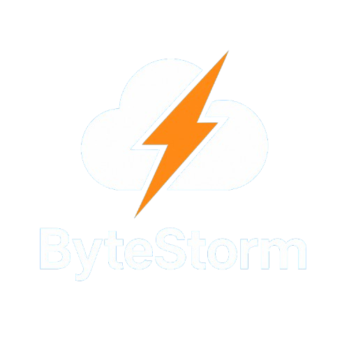

    
     
    <h1>Contribution guidelines for ByteStorm (Minecraft Cloud System)</h1>

---

Thank you for your interest in contributing to ByteStorm! Please follow these guidelines to ensure a smooth process.

## General

- Contributions should be clear, understandable, and well documented.
- Stick to the existing code style and project structure.
- Write code as efficiently as possible and avoid unnecessary dependencies.
- Test your changes thoroughly before creating a pull request.

## Reporting bugs

- Describe the bug as precisely as possible.
- Include relevant log outputs, screenshots, or sample configurations.
- Specify which version(s) are affected.

## Feature requests

- Describe the desired feature and its benefits.
- Check beforehand whether there are already similar suggestions.

## Pull requests

- Fork the repository and work in your own branch.
- Describe in the pull request what has been changed and why.
- Avoid large, confusing changes—small, thematically separate pull requests are preferred.
- Ensure that all tests run successfully.

## Code Guidelines

- Write in Java and adhere to Java conventions.
- Use meaningful names for classes, methods, and variables.
- Document complex logic with comments.
- Remove unused code.

## Communication

- Be respectful and friendly when interacting with each other.
- Use issues and pull requests for discussions about the project.

## License

By contributing, you agree that your code will be published under the license of this project.

---

Thank you for your support!
