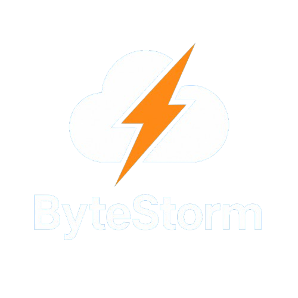

# ⚡ ByteStorm – The modular Minecraft cloud system

## 🚀 Information

This project is in an early stage of development and is constantly being refined.
For the latest information, please check our [Discord](https://discord.gg/WBdY4Daty5) regularly!
To test the cloud, you can create a ticket on our Discord.

> [!IMPORTANT]
> The system is not yet suitable for productive use and should only be used for testing purposes!

---

<p align="center">
    
</p>

**ByteStorm** is a modular, high-performance cloud system for Minecraft server networks.  
It was developed from scratch in Java to ensure scalability, extensibility, and maintainability.  
It follows the principle: **“One module, one task – maximum impact!”** 🧠💻
The cool thing about the project? It is **completely open source**! Anyone can join in and expand the system.
Everyone is welcome to participate in the development and customize the system according to their own needs.
To get involved, check out the [Contributing Guidelines](CONTRIBUTING.md).

---

## 📖 Table of Contents
- [🚀 Information](#-information)
- [📖 Table of Contents](#-table-of-contents)
- [📦 Module Overview](#-module-overview)
  - [common/](#common---utilities--shared-logic) – Utilities & shared logic for all modules
  - [core/](#core---central-control-unit) – Central control unit & main server logic
  - [api/](#api---public-programming-interface) – Public API for external plugins & tools
    - [bridge/common/](#bridgecommon---common-module-for-all-bridge-modules) – Common logic for all bridge modules
    - [bridge/velocity/](#bridgevelocity---proxy-connection-velocity) – Proxy connection for Velocity
    - [bridge/proxy-legacy/](#bridgeproxy-legacy---legacy-proxy-connection-bungeecord--waterfall) – Legacy proxy connection (BungeeCord & Waterfall)
    - [bridge/paper/](#bridgepaper---paper-connection) – Paper server connection
- [controller/](#controller---cli--web-controller) – CLI & web controller for administration
- [agent/](#agent---agent-on-target-servers) – Remote agent on target servers
    - [dashboard/](#dashboard---web-dashboard-optional) – Optional web dashboard for administration
- [🔧 Technical overview](#-technical-overview)
- [📁 Module structure](#-module-structure)
- [🚀 Target audience](#-target-audience)
- [✨ Still in planning](#still-in-planning)
- [📖 License](#license)
- [📞 Contact](#contact)

---

## 📦 Module Overview

Here you will find an overview of all modules and their respective responsibilities in the ByteStorm ecosystem:

---

### `common/` – 🔧 Utilities & Shared Logic
> This module contains general classes and tools that are shared by all other modules:
- Configuration handling
- Logging system
- Utility classes (e.g., for files, time, threads)
- Shared interfaces & enums

---

### `core/` – 💥 Central control unit
> The heart of ByteStorm – executes the server logic:
- Starts and manages internal services
- Lifecycle management (start, stop, reload)
- Event system & command handling
- Coordination of all subsystems

---

### `api/` – 🧩 Public programming interface
> External plugins or tools can use this module to interact with ByteStorm:
- Server groups and templates
- Player information
- Interfaces for third-party developers
- Status and query APIs

---

### `bridge/common/` – 💼 Common module for all bridge modules
> Contains common logic for all bridge modules:
- Common interfaces and classes
- Utility functions for communication
- Event handling for all Minecraft server instances
- Synchronization tools
- Configuration management for bridge modules

### `bridge/velocity/` – 🌉 Proxy connection (Velocity)
> Ensures communication between ByteStorm and Minecraft instances:
- Forwards player events
- Synchronizes data via proxies
- Enables central control via proxy

### `bridge/proxy-legacy/` – 🕰️ Legacy proxy connection (BungeeCord & Waterfall)
> For older BungeeCord installations that have not yet switched to Velocity:
- Offers similar functionality to `bridge/proxy/`
- Compatibility with existing BungeeCord setups
- Enables migration to Velocity in the future

> [!CAUTION]
> This module is included for compatibility purposes only and will not be further developed once it is stable.

### `bridge/paper/` – 🧩 Paper connection
> Connects ByteStorm directly to Paper servers:
- Does the same as `bridge/spigot/`, but optimized for Paper server features
- Use of Paper-specific APIs
- Extensible for future Paper versions

---

### `controller/` – 🖥️ CLI & Web Controller
> Control ByteStorm conveniently via a command line or web UI:
- CLI input & parsing
- Web server with REST API
- Authentication & access control
- Management of server groups and templates
- Real-time status queries
- Webhooks for external integrations

---

### `agent/` – 🤖 Agent on target servers
> Runs directly on Minecraft servers for remote control:
- Starts/stops Minecraft instances
- Sends status data back to Core
- Updater & heartbeat system

---

### `dashboard/` – 📊 Web dashboard (optional)
> Attractive, modern UI for managing your server structure:
- Displays player & server status
- Start/stop servers via the web
- Manage templates & groups
- User management with tokens

---

## 🔧 Technical overview

- **Language:** Java 21
- **Build system:** Gradle (Groovy DSL, multi-module)
- **Design principles:** OOP, single responsibility, dependency injection, modularity
- **Goal:** High-performance, expandable Minecraft cloud system with professional infrastructure

---

## 📁 Module structure

```plaintext
ByteStorm/
├── common/ → Shared code
├── core/ → Central control
├── api/ → Public API
├── bridge/ → Connection to proxies
│   ├── common/ → Shared logic for all bridge modules
│   ├── velocity/ → Velocity proxy
│   ├── proxy-legacy/ → BungeeCord proxy
│   ├── spigot/ → Spigot connection
│   ├── paper/ → Paper connection
│   ├── aspaper/ → Advanced Slime Paper connection
│   ├── purpur/ → Purpur connection
│   ├── folia/ → Folia connection
│   └── minestom/ → Minestom connection
├── controller/ → CLI & Web server
├── agent/ → Remote agent
├── dashboard/ → external admin interface
└── README.md → Documentation
```

---

## 🚀 Target audience

- Developers of Minecraft server networks
- Plugin developers who need server-side control
- Server administrators who want an easy-to-control but powerful system

---

## ✨ Still in planning

- Database modules (Redis/MySQL)
- Plugin marketplace
- Extension API
- Discord bot for control via chat

---

## 📖 License
ByteStorm is licensed under the [MIT License](LICENSE).

---

## 📞 Contact
> Do you have questions, ideas, or just want to get involved?
> Check out our [Discord](https://discord.gg/WBdY4Daty5) or open an issue on GitHub!

---

Ready to take your network to the next level? Welcome to **ByteStorm**! 🫡⚔️

---

<p align="center">
    This project was created by <a href="https://github.com/whynotmax/">whynotmax</a> and the <a href="https://github.com/NextForge-Development">nextforge.gg</a> team.
    <br>
    ©️ 2025 ByteStorm Team. All rights reserved.
</p>
